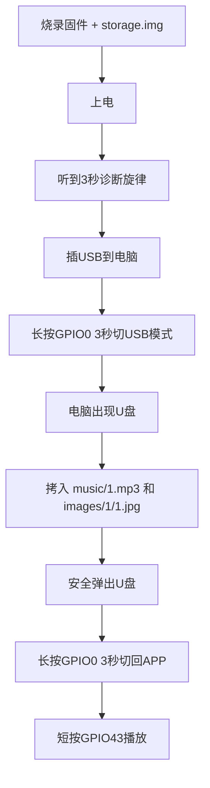

# ESP32-S3 MP3 Player — 使用说明

> 基于 ESP32-S3 N16R8 + ES8311 + ST7789 240x320 TFT 的 MP3 播放器
> 支持 USB MSC 模拟U盘、JPG/BMP 图片自动缩放显示、I2C Slave 外部控制

---

## 📦 硬件清单

| 组件 | 型号 | 说明 |
|------|------|------|
| **主控** | ESP32-S3 N16R8 | 16MB Flash + 8MB OPI PSRAM |
| **音频Codec** | ES8311 | I2S 接口，立体声 |
| **显示屏** | 240×320 TFT (ST7789V) | SPI 接口，RGB565 |
| **功放** | 任意 PA 模块 | 使能引脚 GPIO46 |
| **按键** | 2个轻触开关 | GPIO0 + GPIO43 |

> ⚠️ **无需 SD 卡**：所有文件存储在 SPI Flash 的 FATFS 分区中，通过 USB MSC 模拟U盘传输

---

## 🔌 引脚连接

### 音频 — ES8311

| ESP32-S3 引脚 | 连接 | 说明 |
|:------------:|:----:|:----|
| GPIO45 | MCLK | I2S 主时钟 |
| GPIO41 | LRCK/WS | I2S 字选择 |
| GPIO39 | BCLK | I2S 位时钟 |
| GPIO40 | DIN | I2S 数据输入（ES8311→ESP） |
| GPIO42 | DOUT | I2S 数据输出（ESP→ES8311） |
| GPIO4 | SDA | I2C 控制总线 |
| GPIO5 | SCL | I2C 控制总线 |
| GPIO46 | PA_EN | 功放使能（高电平有效） |

### 显示 — ST7789

| ESP32-S3 引脚 | 连接 | 说明 |
|:------------:|:----:|:----|
| GPIO1 | DC | 数据/命令选择 |
| GPIO2 | CS | 片选 |
| GPIO21 | SCLK | SPI 时钟（20MHz，DMA传输） |
| GPIO47 | MOSI | SPI 数据 |
| GPIO14 | BL | 背光（PWM 调光） |

### 外部控制 — I2C Slave

| ESP32-S3 引脚 | 说明 |
|:------------:|:----|
| GPIO38 | I2C Slave SDA（地址 0x52） |
| GPIO48 | I2C Slave SCL（地址 0x52） |

### 按键

| 按键 | 引脚 | 短按 | 长按（≥2秒） |
|:----:|:----:|:----|:------------|
| **上一曲** | GPIO0 | ⏮ 上一曲 | 🔄 切换 APP/USB 模式 |
| **下一曲** | GPIO43 | ⏭ 下一曲 | ⚙️ 进入设置菜单 |

---

## 🔥 烧录教程

### 方法一：从 GitHub Actions 下载固件（推荐）

1. 打开 [GitHub Actions 页面](https://github.com/rainrainrainbow/esp32s3-mp3-player/actions?query=branch%3Aminimal-player)
2. 点击最新的 **绿色 ✅ 构建**
3. 在页面底部找到 **Artifacts**，下载 `firmware.zip`
4. 解压得到以下文件：
   - `bootloader.bin`
   - `partition-table.bin`
   - `esp32s3_mp3_player.bin`
   - `storage.img`（⚠️ 存储分区镜像，首次烧录必需）

### 方法二：本地编译

```bash
# 设置 ESP-IDF v6.1 环境
. $HOME/esp/esp-idf/export.sh

# 克隆仓库
git clone -b minimal-player https://github.com/rainrainrainbow/esp32s3-mp3-player.git
cd esp32s3-mp3-player

# 编译
idf.py set-target esp32s3
idf.py build

# 编译后生成的文件在 build/ 目录下
```

### 烧录命令

#### 首次烧录（含存储分区）

```bash
# Windows（请替换 COM_PORT 为实际端口，如 COM3）
esptool.py --chip esp32s3 -p COM_PORT -b 921600 write_flash \
    0x0 bootloader.bin \
    0x8000 partition-table.bin \
    0x10000 esp32s3_mp3_player.bin \
    0x310000 storage.img

# Linux/macOS（请替换 /dev/ttyUSB0 为实际端口）
esptool.py --chip esp32s3 -p /dev/ttyUSB0 -b 921600 write_flash \
    0x0 bootloader.bin \
    0x8000 partition-table.bin \
    0x10000 esp32s3_mp3_player.bin \
    0x310000 storage.img
```

#### 更新固件（保留存储分区内容）

```bash
# 只烧录固件，不烧 storage.img（保留已拷入的音乐/图片）
esptool.py --chip esp32s3 -p COM_PORT -b 921600 write_flash \
    0x0 bootloader.bin \
    0x8000 partition-table.bin \
    0x10000 esp32s3_mp3_player.bin
```

> ⚠️ **注意**：首次烧录**必须**烧录 `storage.img`，否则 FATFS 分区未格式化，系统无法挂载！
> 后续更新固件时，**不要**烧录 `storage.img`，否则会清空所有已拷入的文件。

---

## 📁 文件结构

### 存储分区布局

| 分区 | 偏移地址 | 大小 | 文件系统 |
|:----|:--------|:----|:--------|
| bootloader | 0x00000 | — | — |
| partition table | 0x08000 | — | — |
| firmware | 0x10000 | 约3MB | — |
| **storage** | **0x310000** | **约13MB** | **FATFS** |

### 文件目录结构

将设备通过 USB 连接到电脑后，长按 **GPIO0**（3秒）切换到 USB 模式，电脑上会出现一个 U 盘。

U 盘内的目录结构如下：

```
/spiflash/
├── music/              ← 存放 MP3 文件
│   ├── 1.mp3           ← 曲目 1
│   ├── 2.mp3           ← 曲目 2
│   ├── 3.mp3           ← 曲目 3
│   └── ...
└── images/             ← 存放图片（每首曲目对应一个子目录）
    ├── 1/
    │   └── 1.jpg       ← 曲目 1 的封面图片
    ├── 2/
    │   └── 2.jpg       ← 曲目 2 的封面图片
    ├── 3/
    │   └── 3.jpg
    └── ...
```

### 文件命名规则

| 项目 | 规则 | 示例 |
|:----|:----|:----|
| **音乐文件** | `{数字}.mp3` | `1.mp3`、`2.mp3` |
| **图片目录** | `images/{数字}/` | `images/1/`、`images/2/` |
| **图片文件** | `{数字}.jpg` 或 `{数字}.bmp` | `1.jpg`、`2.bmp` |
| **图片格式** | JPG 或 24-bit BMP | 不支持 4-bit BMP |

> 曲目编号从 1 开始，连续编号（如 1.mp3、2.mp3...），系统会自动扫描 `music/` 目录下的文件数量。

---

## 🎮 操作指南

### 首次使用流程



### 按键操作

| 操作 | 按键 | 效果 |
|:----|:----|:----|
| **短按** | GPIO43 | ▶ 播放 / ⏭ 下一曲 |
| **短按** | GPIO0 | ⏮ 上一曲 |
| **长按 2秒** | GPIO43 | ⚙️ 进入/退出设置菜单 |
| **长按 3秒** | GPIO0 | 🔄 切换 APP ↔ USB 模式 |

### 设置菜单操作

| 操作 | 按键 | 效果 |
|:----|:----|:----|
| 长按 GPIO43 | — | 进入设置菜单 |
| 短按 GPIO43 | ⏭ | 切换选项（音量 ↔ 亮度） |
| 短按 GPIO0 | ⏮ | 调整值（每次 ±5） |
| 长按 GPIO43 | — | 退出设置菜单 |

设置菜单中可调节：
- **音量**：0-100（映射到 ES8311 硬件寄存器）
- **亮度**：0-100（PWM 背光控制）

---

## 🖥️ 界面说明

### 1. 开机欢迎界面

```
┌──────────────────────┐
│   ESP32-S3 MP3       │
│   Player              │
│                      │
│   Loading...          │
│                      │
│   ♪ 诊断旋律 3秒      │
└──────────────────────┘
```

### 2. 停止/待机界面

```
┌──────────────────────┐
│                      │
│      ⏹ STOP         │
│                      │
│   Track 1            │
│                      │
│   GPIO43: Play       │
│                      │
└──────────────────────┘
```

### 3. 播放界面

```
┌──────────────────────┐
│                      │
│   [图片幻灯片]       │
│   (5秒自动切换)      │
│                      │
│   Now Playing        │
│   Track 1            │
│                      │
└──────────────────────┘
```

> 图片自动缩放适应 240×320 屏幕，JPG/BMP 均支持。
> 开机时预加载所有图片到缓存，播放时秒切无延迟。

### 4. 设置菜单

```
┌──────────────────────┐
│   ⚙ Settings         │
│                      │
│   ▶ Volume: 50%      │
│     Brightness: 80%  │
│                      │
│   GPIO43: Switch     │
│   GPIO0: Adjust      │
│   Hold: Exit         │
└──────────────────────┘
```

---

## 🔌 I2C Slave 控制协议

外部 MCU 可通过 I2C 总线向 ESP32-S3（地址 **0x52**）发送命令控制播放。

### 寄存器映射

| 寄存器地址 | 方向 | 取值范围 | 说明 |
|:---------:|:----:|:--------:|:----|
| `0x01` | 写 | 1-255 | 播放指定曲目编号 |
| `0x02` | 读 | 0-4 | 读取播放状态 |
| `0x03` | 读 | 0-255 | 读取当前曲目编号 |
| `0x04` | 读/写 | 0-100 | 读取/设置音量 |
| `0x05` | 读/写 | 0-100 | 读取/设置亮度 |

### 状态值说明（寄存器 0x02）

| 值 | 说明 |
|:--:|:----|
| 0 | 停止 |
| 1 | 播放中 |
| 2 | 暂停 |
| 3 | 切换中 |
| 4 | 错误 |

### 通信示例

```
// 示例：播放第5首曲目
I2C Master → 0x52: [0x01, 0x05]    // 写入曲目编号

// 示例：读取播放状态
I2C Master → 0x52: [0x02]           // 发送寄存器地址
I2C Slave  → Master: 0x01           // 返回：播放中

// 示例：设置音量为 70%
I2C Master → 0x52: [0x04, 0x46]    // 0x46 = 70

// 示例：读取当前亮度
I2C Master → 0x52: [0x05]           // 发送寄存器地址
I2C Slave  → Master: 0x50           // 返回：80%
```

---

## 🖼️ 图片规格说明

| 项目 | 支持格式 | 说明 |
|:----|:--------|:----|
| **JPEG** | `.jpg` / `.jpeg` | 任意分辨率，自动缩放适配屏幕 |
| **BMP** | `.bmp`（24-bit） | 任意分辨率，自动缩放适配屏幕 |
| **不支持** | 4-bit BMP | 请转换为 24-bit BMP 或 JPG |

> 图片解码使用 `esp_jpeg` 软件解码库（ESP32-S3 无硬件 JPEG 解码器）。
> 缩放算法：最近邻插值，整数运算，高效快速。

---

## ⚙️ 系统架构

### 任务栈分配

| 任务 | 栈大小 | 职责 |
|:----|:-----:|:----|
| `slideshow_task` | 8192 字节 | 图片幻灯片展示（仅从缓存读取，无解码） |
| `button_task` | 16384 字节 | 按键处理、图片预加载（JPEG解码）、启动播放 |

### 图片预加载机制

- **缓存大小**：16 张图片
- **触发时机**：
  1. 🔌 **开机时**：自动预加载第 1 首曲目的图片
  2. 🎵 **切换曲目时**：按键或 I2C 控制切换时预加载
  3. 🔄 **USB 切回 APP 时**：自动预加载
- `slideshow_task` 仅从缓存读取，**不做任何解码**，确保秒切

---

## 🛠️ 本地开发

### 环境要求

- ESP-IDF v6.1（推荐使用 [v6.1 分支](https://github.com/espressif/esp-idf/tree/release/v6.1)）
- Python 3.8+
- Git

### 编译

```bash
# 设置环境
. $HOME/esp/esp-idf/export.sh

# 克隆仓库
git clone -b minimal-player https://github.com/rainrainrainbow/esp32s3-mp3-player.git
cd esp32s3-mp3-player

# 配置目标芯片
idf.py set-target esp32s3

# 编译
idf.py build

# 编译完成后，固件在 build/ 目录下
```

### 生成 storage.img

```bash
# 创建一个 13MB 的 FATFS 镜像
dd if=/dev/zero of=storage.img bs=1M count=13
mkfs.fat -F 12 storage.img

# 或者直接使用 build 目录下的镜像
# idf.py build 会自动生成 storage.img
```

---

## 🔧 常见问题

### Q: 上电后没有声音？

- 检查 PA_EN（GPIO46）是否拉高
- 检查 ES8311 的 I2C 连接是否正确
- 检查音量是否不为 0

### Q: 屏幕不显示？

- 检查 `config.h` 中是否定义了 `DISPLAY_SPI_HOST`（必须为 `SPI2_HOST`）
- 检查 SPI 接线（DC=GPIO1, CS=GPIO2, CLK=GPIO21, MOSI=GPIO47）

### Q: 图片显示是镜像的？

- MADCTL 寄存器必须设置为 `0x08`（BGR，无镜像）
- 如果显示反色，尝试在 `tft_init()` 中移除 `INVON` 命令

### Q: U 盘无法识别？

- 确保已长按 GPIO0（3秒）切换到 USB 模式
- 检查 USB 数据线是否支持数据传输
- 首次使用需要烧录 `storage.img`

### Q: 播放时重启？

- 检查 `button_task` 栈大小是否 ≥ 16384
- 检查图片路径数组是否使用堆分配（`calloc`/`malloc`）
- 检查 `slideshow_task` 栈大小是否 ≥ 8192

### Q: 图片缩放太慢？

- 确保预加载机制工作正常（开机时预加载，播放时从缓存读取）
- 检查日志中是否有 `Preloading images from...` 信息

---

## 📊 构建历史

| Build | Commit | 状态 | 说明 |
|:-----|:------|:----:|:----|
| #191 | `241f92d` | ✅ | button_task 栈 3072→16384 |
| #190 | `fdac1f3` | ✅ | 栈溢出修复（预加载堆分配） |
| #189 | `84c3a94` | ✅ | esp_jpeg API 修复 |
| #181 | `b72d139` | ✅ | 音量逻辑修复 |
| #180 | `b3bc89d` | ✅ | I2C Slave 集成 |
| #170 | `3662740` | ✅ | 屏幕镜像修复 |
| #167 | `a2a4cd7` | ✅ | DMA 优化 |

---

## 📝 许可证

MIT License

---

## 🔗 相关链接

- [GitHub 仓库](https://github.com/rainrainrainbow/esp32s3-mp3-player)
- [ESP-IDF 文档](https://docs.espressif.com/projects/esp-idf/en/v6.1/)
- [ES8311 数据手册](https://www.espressif.com/sites/default/files/documentation/ES8311_DS_EN.pdf)